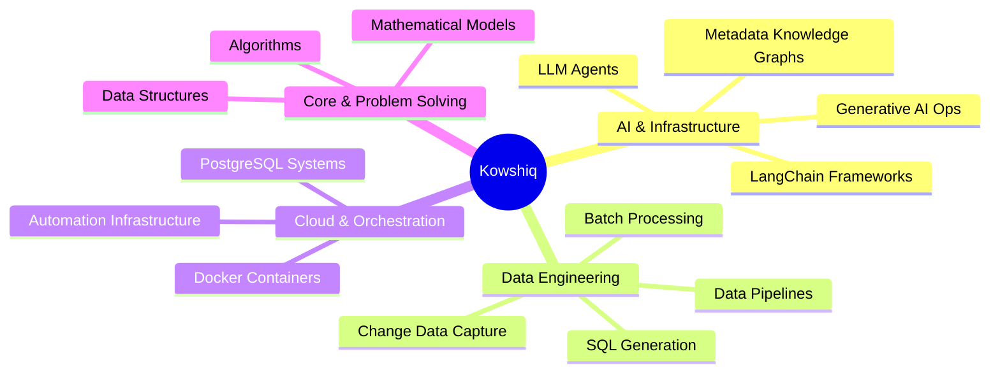

  

  

  

    
    
    
    
    
  

---

## About Me

I am a Data Engineering, Management & Governance Analyst at Accenture with a strong interest in Machine Learning, Generative AI, and AI-powered data systems. My work focuses on building scalable data infrastructure, metadata-driven architectures, intelligent automation frameworks, and LLM-enabled analytics solutions. I enjoy operating at the intersection of Data Engineering, AI Infrastructure, and Applied Machine Learning. 

Beyond enterprise systems, I have a deep passion for tutoring, content creation, and mathematics holding distinction as an Abacus Grand Master, published Author of **[100 Wizard Problems of Mathematics](https://www.amazon.in/Wizard-Problems-Mathematics-Kowshiq-Kattamuri/dp/9390447712)**, and tech creator on my YouTube channel, **[Kattamuri Kowshiq](https://www.youtube.com/@KattamuriKowshiq)**.

<table>
  <tr>
    <td width="50%">
      <h3>Current Focus</h3>
      <ul>
        <li>Reliable, scalable data pipelines & AI infrastructure</li>
        <li>Metadata Knowledge Graphs & Data Governance Analytics</li>
        <li>LLM Agent orchestration & LangChain frameworks</li>
        <li>Automated smart ingestion pipelines with change detection</li>
        <li>AI-powered automated SQL generation systems</li>
      </ul>
    </td>
    <td width="50%">
      <h3>Quick Signal</h3>
      <ul>
        <li>B.Tech, National Institute of Technology Calicut (2020-2024)</li>
        <li>Data Engineering, Management and Governance Analyst at Accenture</li>
        <li>GATE DA 2026: AIR 281 | Score 723</li>
        <li>GATE CSE 2026: AIR 2179 | Score 640</li>
        <li>NPTEL Certified in Applied Linear Algebra for AI & ML</li>
        <li>730+ LeetCode problems solved (C++, MySQL, JS)</li>
        <li>Abacus Grand Master & Math Geek</li>
        <li>Tech Speaker, Author, YouTuber & Tutor</li>
      </ul>
    </td>
  </tr>
</table>

## Impact Highlights
<table>
  <tr>
    <td align="center" width="33%">
      <h3>1,735</h3>
      Max LeetCode Contest Rating (Top 11.2%)
    </td>
    <td align="center" width="33%">
      <h3>730+</h3>
      DSA & Database Problems Mastered
    </td>
    <td align="center" width="33%">
      <h3>4,000+</h3>
      Professionals engaged via LinkedIn tech content
    </td>
  </tr>
</table>

## Academic & Professional Credentials

  <table width="100%">
    <tr>
      <td width="50%" valign="top">
        

          <h3>🚀 Core Data Engineering</h3>
          

           
          <b>🔹 Professional Data Engineer in Python</b> — <i>DataCamp</i> 
          <small>Advanced containerization (Docker), schema orchestration (dbt), and high-throughput big data streaming pipelines (PySpark, Apache Kafka).</small>
            
          <b>🔹 Associate Data Engineer in SQL</b> — <i>DataCamp</i> 
          <small>Relational database architecture, advanced indexing, and structural query optimization utilizing production PostgreSQL and Snowflake engines.</small>
            
          <b>🔹 Modern Data Engineering Essentials</b> — <i>Pearson</i> 
          <small>Architecting modern analytics workloads leveraging lightweight analytical compute (DuckDB) alongside robust orchestrators (dbt, Airflow, Dagster).</small>
        

      </td>
      <td width="50%" valign="top">
        

          <h3>🤖 Applied AI & Academic Elite</h3>
          

           
          <b>👑 GATE DA (Data Science & AI)</b> — <i>All India Rank 281</i> 
          <small>Demonstrated elite foundational mastery across Probability, Linear Algebra, Machine Learning models, and Deep Database Architectures.</small>
            
          <b>🔹 Fundamentals of AI Engineering</b> — <i>LinkedIn Learning</i> 
          <small>Designing production RAG frameworks, fine-tuning retrieval logic using vector databases, hybrid search pipelines, and LLM observability.</small>
            
          <b>🥈 Quantum Computing & Algorithms</b> — <i>NPTEL (IIT Madras)</i> 
          <small><b>Topper (Top 5% Elite + Silver)</b>. Evaluated on quantum mechanics foundations, Shor's/Grover's algorithms, and hands-on Qiskit circuit design.</small>
        

      </td>
    </tr>
  </table>

## Tech Stack

### Languages & Core Frameworks

### Databases, Big Data & Tooling

## Experience
<table>
  <tr>
    <td width="35%">
      <h3>Accenture</h3>
      <b>Advanced Application Engineering Analyst</b> 
      Data Engineering, Management & Governance 
      2024 - Present
    </td>
    <td width="65%">
      <ul>
        <li>Designing and building reliable, scalable data pipelines & AI infrastructure layers.</li>
        <li>Utilizing metadata knowledge graphs combined with LLM agents to orchestrate data workflows.</li>
        <li>Optimizing query paths, building change detection systems, and automating enterprise schema ingestions.</li>
        <li>Presenting technical deep-dives into open-source database engines and system optimizations at community events.</li>
      </ul>
    </td>
  </tr>
</table>

## Featured Projects
<table>
  <tr>
    <td width="50%">
      <h3>AI-Powered Knowledge Graph Agent</h3>
      
A prototype system that combines a metadata knowledge graph with an LLM agent to automatically generate and execute SQL queries for analytics.

      <ul>
        <li>Automated query synthesis using text-to-SQL structures</li>
        <li>Context-aware data mapping via architectural metadata graphs</li>
        <li>Built natively using Python and LangChain frameworks</li>
      </ul>
      
    </td>
    <td width="50%">
      <h3>Auto-Ingestor Smart Pipeline</h3>
      
Intelligent Excel-to-PostgreSQL pipeline built in Python featuring lightweight automated change detection.

      <ul>
        <li>Automated data cleaning and structural validation operations</li>
        <li>Change Data Capture (CDC) mechanics to track record versions updates</li>
        <li>Eliminated redundant manual ingestion steps for tabular sets</li>
      </ul>
      
    </td>
  </tr>
  <tr>
    <td width="50%">
      <h3>Docker Data Engineering Practice</h3>
      
A comprehensive runtime playground containing configured orchestration templates for standard data pipelines.

      <ul>
        <li>Isolated container setups for database storage frameworks</li>
        <li>Production-grade configurations for reliable distributed workloads</li>
        <li>Streamlined environment onboarding paths for developers</li>
      </ul>
      
    </td>
    <td width="50%">
      <h3>ML Implementations</h3>
      
Hands-on architectural exploration of core machine learning workflows and predictive algorithms.

      <ul>
        <li>Notebook architectures clarifying structural calculations</li>
        <li>Connects underlying system engineering with mathematical theory</li>
        <li>Foundational components bridging raw parameters to target outputs</li>
      </ul>
      
    </td>
  </tr>
</table>

## What I Build

## Competitive Programming

  <table width="100%">
    <tr>
      <td align="center" width="50%">
        <h3>LeetCode</h3>
        
<b>730+ Problems Solved</b> Max Rating: 1735 (Top 11.2%)

      </td>
      <td align="center" width="50%">
        <h3>Languages Mastery</h3>
        
C++ (624 Solved) MySQL (50 Solved) | JavaScript (30 Solved)

      </td>
    </tr>
  </table>

## GitHub Snapshot

  
  
    
  

## Engineering Principles

  <table width="100%">
    <tr>
      <td align="center" width="25%" valign="top">
        <b>Scalable</b> 
        <small>Pipelines must gracefully process expanding datasets.</small>
      </td>
      <td align="center" width="25%" valign="top">
        <b>Automated</b> 
        <small>Minimize human touchpoints through dynamic workflows.</small>
      </td>
      <td align="center" width="25%" valign="top">
        <b>Governed</b> 
        <small>Maintain strict metadata integrity and structural design.</small>
      </td>
      <td align="center" width="25%" valign="top">
        <b>Consistent</b> 
        <small>Shipping clean, functional code systematically beats short intensity.</small>
      </td>
    </tr>
  </table>

---

  <h3>Consistency beats intensity — shipping every day.</h3>
  

